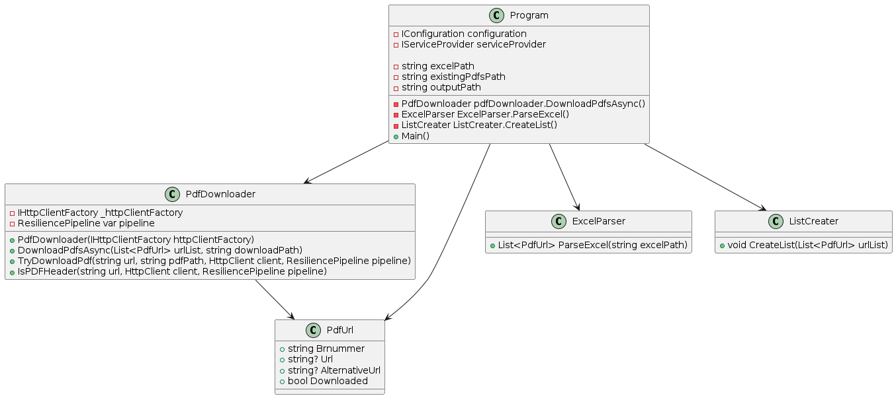

# spac_uge4_SD

## Overview

This project is designed to download PDF files from URLs listed in an Excel file and save them to a specified directory. It also generates a report of the download status.

## Project Structure

spac_uge4_SD/
├── .gitignore
├── README.md
├── CshScript/
│   ├── appsettings.json
│   ├── CshScript.csproj
│   ├── Program.cs
│   ├── Models/
│   │   └── PdfUrl.cs
│   ├── Utilities/
│   │   ├── ExcelParser.cs
│   │   ├── ListCreater.cs
│   │   └── PdfDownloader.cs
│   └── bin/
│   └── obj/
├── data/
│   ├── GRI_2017_2020 (1).xlsx
│   └── Metadata2006_2016.xlsx
└── output/
    └── dwl

## Getting Started

### Prerequisites

- .NET 9.0 SDK
- An Excel file with URLs to download PDFs from

### Configuration

Update the `appsettings.json` file with the correct paths for your Excel file and output directory, and set the number of rows to parse:

Example:

```json
{
  "Paths": {
    "excelPath": "../data/GRI_2017_2020 (1).xlsx",
    "outputPath": "../output/dwn"
  },
  "Parsing": {
    "NumberOfRows": 30
  }
}
```

### Running the project

To downoad all necesarry packages write "dotnet restore" in the command line. Write "dotnet run" to run it.

## Code Overview

### Main Components

* `Program.cs`: The entry point of the application. It sets up the configuration, initializes services, and orchestrates the PDF download and report generation process.
* `PdfDownloader.cs`: Contains the logic for downloading PDFs using an `HttpClient` and a resilience pipeline.
* `ExcelParser.cs`: Parses the Excel file to extract URLs.
* `ListCreater.cs`: Generates a report of the download status in an Excel file.
* `PdfUrl.cs`: Represents the model for PDF URLs.

## Diagram

The following diagram provides an overview of the program classes and their interactions:


